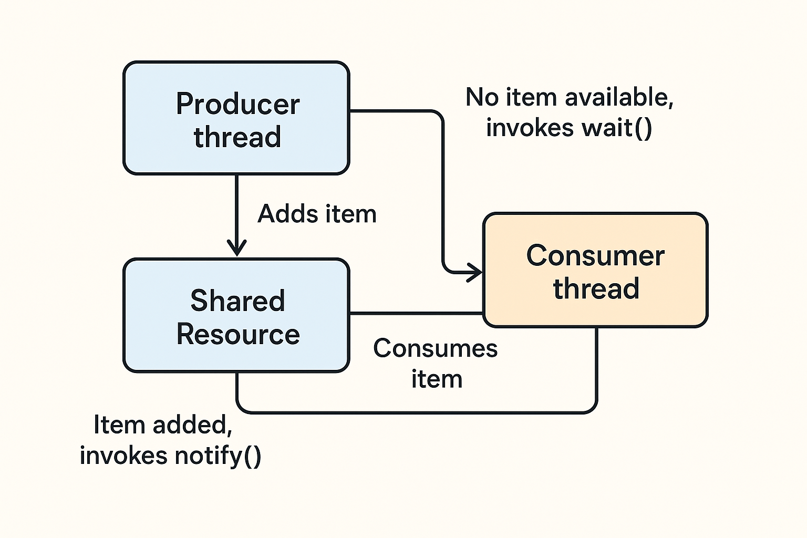

# Java Multithreading Producer-Consumer Example

## The Story

Imagine we have one box (shared between people).

A **Producer** will put an item in the box.

A **Consumer** will take the item from the box.

But there's a rule:
- The consumer cannot take something if the box is empty.
- The producer cannot put another item if the box already has one (in this code, we don't handle this case, but we could).

We also have two threads (like two separate workers) running at the same time.

We need to coordinate them so they don't get in each other's way.

## File 1: SharedResourceMulti.java

This is our shared box.

```java
public boolean isItemAvailable = false; // Box is empty initially
```

Two main actions happen here:

### addItem() – Producer puts an item inside
- `synchronized` means only one thread at a time can use this method.
- Sets `isItemAvailable = true`.
- Says "Hey, item added! Wake up all waiting threads" → `notifyAll()`.

### consumeItem() – Consumer tries to take an item
- Also synchronized to avoid two threads using it at once.
- If `isItemAvailable` is false, the consumer:
    - Prints that it's waiting.
    - Goes to sleep (`wait()`) until someone calls `notifyAll()`.
- If item is there, it takes it and sets `isItemAvailable = false`.

### 📌 Why `while` and not `if`?
Because even after waking up, a thread should re-check the condition in case the item isn't there anymore (this is called a spurious wakeup).

## File 2: ConsumerTask.java

This is the Consumer worker.

```java
@Override
public void run() {
    System.out.println("Consumer Thread:" + Thread.currentThread().getName());
    sharedResourceMulti.consumeItem();
}
```

When a consumer starts:
1. It says "I'm the consumer thread".
2. It tries to consume an item from the shared resource (box).
3. If the box is empty, it waits until the producer puts something in.

## File 3: ProducerTask.java

This is the Producer worker.

```java
@Override
public void run() {
    System.out.println("Producer thread: " + Thread.currentThread().getName());
    Thread.sleep(5000); // Pretend it's busy making an item
    sharedResourceMulti.addItem();
}
```

When the producer starts:
1. Says "I'm the producer thread".
2. Waits for 5 seconds (to simulate making something).
3. Puts an item in the box and wakes up the consumer.

## File 4: SharedResourceClient.java

This is the Main movie director.

```java
SharedResourceMulti sharedResourceMulti = new SharedResourceMulti();
Thread producerThread = new Thread(new ProducerTask(sharedResourceMulti));
Thread consumerThread = new Thread(new ConsumerTask(sharedResourceMulti));

producerThread.start();
consumerThread.start();
```

What happens:
1. Creates the shared box (SharedResourceMulti).
2. Creates one producer thread and one consumer thread, both sharing the same box.
3. Starts both threads almost at the same time.

## Timeline of Events

If you run this:

1. Main thread says "Main Method start".
2. Producer says "Producer thread: Thread-0".
3. Consumer says "Consumer Thread: Thread-1".
4. Consumer tries to consume → sees no item → waits.
5. Producer waits 5 seconds, then adds an item and calls `notifyAll()`.
6. Consumer wakes up, sees item, consumes it, and sets box empty again.

## Why This Is Multithreading

- **Threads**: Producer and consumer run in parallel.
- **Synchronization**: Prevents them from messing with the box at the same time.
- **wait() / notifyAll()**: Used to pause and wake threads so they work in order.

